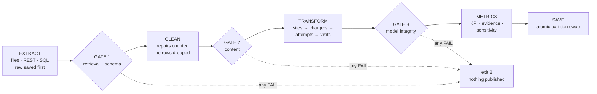

# Voltra Charging Network — Charging Reliability Data Pipeline

> **"Our fast chargers report 99% uptime — so why do 1 in 7 drivers fail on their first try?"**

A dependable monthly data pipeline that turns fragmented EV-charging data into a trustworthy measure of the reliability
drivers actually experience. It was built for the FDE Data Foundations assignment (Classes 4–8, Track C:
*from client data to a dependable pipeline*). The client, **Voltra, is a fictional persona**. The charging sessions and
the station registry are **real public data**. Two operator systems no one publishes are **simulated and labelled as
such** (§5).

| At a glance | |
|---|---|
| **KPI** | First-Time Charge Success (FTCS): **86.03%** in the baseline quarter (Nov 2024 – Jan 2025), 83.87% over 13 months |
| **Decision it supports** | Send crews to **S40, S17, S01, S08, S28** (→ 87.01%, the 6-week target), check **S29**, and make the charging software record **port + error code on every attempt** |
| **The judgement call** | 2,187 attempts with no port id were **kept as failed attempts**, not dropped. Dropping them would have shown **90.33%** — the stretch target, "met" with no repair at all (§4) |
| **Run it** | `python run_pipeline.py --offline` → about 10 s, exit code 0, results in `data/processed/run_date=2025-02-01/` |
| **Trust it** | 3 validation gates (33 checks), 5 failure demos, 30 tests, byte-identical reruns |

**Contents:** [1 Problem](#1-the-problem-in-60-seconds) · [2 Decision](#2-the-decision-this-supports-and-for-whom) ·
[3 KPI](#3-the-kpi--first-time-charge-success-ftcs) · [4 Judgement call](#4--the-fde-judgement-call-keep-the-port-less-attempts) ·
[5 Sources](#5-data-sources-and-where-the-truth-lives) · [6 Pipeline](#6-how-the-pipeline-works) ·
[7 Run it](#7-run-it) · [8 Failure demos](#8-show-me-it-fails-safely) · [9 Results](#9-results) ·
[10 Limits](#10-what-this-data-can-not-tell-you) · [11 Rubric map](#11-where-each-rubric-pillar-is-evidenced) ·
[12 Decisions](#12-decisions-self-corrections-and-reviews) · [13 Build history](#13-how-it-was-built-phase-by-phase) ·
[14 Layout](#14-repository-layout) · [15 Provenance](#15-data-provenance-and-honesty-notes)

---

## 1. The problem in 60 seconds
The operator's dashboard reports ~99% uptime, while customers say the chargers don't work. We examined 46,575 real
charging sessions (Jan 2024 – Jan 2025) from 88 DC fast chargers at 40 physical sites:

- **FTCS is 86.03%** in the baseline quarter. That means **1 in 7 drivers fail on their first try**.
- **1 in 5 charge attempts delivers no usable energy** (< 1 kWh), yet **none of the 46,575 sessions carries an error
  code**. Nobody is told why.
- **29.6% of failed attempts have no port recorded.** They died before a port was bound, so no connector-level uptime
  or fault record can see them.
- **Uptime cannot see these failures.** The same fleet reads 99.77% on the operator's definition and 98.18% on a
  federal-style definition (both from the *simulated* status feed, illustrative). Availability inferred from the real
  sessions is 97.05%. And drivers experience **86.03%**.

## 2. The decision this supports (and for whom)
**Question:** *which sites need crews now, and what must the operator start recording before it can fix the rest?*

**Answer (run 2025-02-01):**
1. **Send crews to S40, S17, S01, S08 and S28.** These are the five sites more than 5 points below the median site.
   Lifting them to the median takes network FTCS from 86.03% to **87.01%**, the 6-week target. S28 is borderline: 0.05
   points past the threshold, on 75 visits.
2. **Check S29 (Bristol).** Two of its four chargers have had no session at all since 5–6 January 2025, while the other
   two keep charging. The KPI cannot see this, because drivers simply use the chargers that work.
3. **Instrumentation ask to the charging-software vendor:** record the **port and an error code on every attempt**.
   Without them, a ≥ 90% target and any root-cause work are guesswork.

| Stakeholder | Uses the output for | Owns |
|---|---|---|
| VP Operations / NOC | Where to send crews; whether "uptime" can stay the headline | The 99% uptime claim, status feed |
| Field-service vendor | Prioritised site list | Work orders |
| Customer Experience | Driver-level KPI | Complaints, driver outcomes |
| Grants & Compliance | Federal-style uptime vs driver reality | Reporting to funders |
| CPMS (charging-software) vendor | Instrumentation asks (port, error code) | Session data |
| Site hosts | Site scorecard | Sites |

No KPI owner is documented. The validation gate flags this as **UNKNOWN**, and the definition needs sign-off.

## 3. The KPI — First-Time Charge Success (FTCS)
**FTCS = driver visits whose first attempt delivered ≥ 1 kWh ÷ all driver visits.**

- **Attempt:** one charging session on a DC fast charger. It succeeds if it delivers ≥ 1 kWh (the UC Davis
  peer-reviewed screen; 93.6% of sub-1 kWh attempts are exactly 0 kWh, so the threshold barely matters).
- **Visit:** consecutive attempts at the same physical site, each starting within −2 to +5 minutes of the previous
  one ending. Drivers change charger when one fails, so visits are grouped per site, not per charger. The 5 minutes
  comes from UC Davis and matches our own retry-gap analysis.
- **Baseline:** the three most recent monthly exports. **Target:** ≥ 87% in 6 weeks; stretch ≥ 90% next quarter.
- **Robust by design:** across every tested definition, FTCS stays within 82.4–84.8% (13 months) and 84.5–86.6%
  (baseline quarter).

**Why this KPI and not uptime or attempt success?** Uptime measures the charger's point of view, and a failed
handshake returns the connector to *Available*. Attempt success counts retries as extra failures. FTCS measures what
the driver experiences: *did I get a charge the first time I tried?*

Every rule is versioned in [`config/kpi_definitions.json`](config/kpi_definitions.json) (v1.3.1) and justified in
[`docs/decisions_log.md`](docs/decisions_log.md). Metric definitions and the KPI tree:
[`docs/data_model.md`](docs/data_model.md).

## 4. ⭐ The FDE judgement call: keep the port-less attempts
**The situation.** 2,187 session rows (4.7%) have a blank `port_id`. Every cleaning checklist says a row with a
missing key is a bad row, so the reflex is to drop it.

**What I checked before touching them:**
| Test | Result | Meaning |
|---|---|---|
| Which chargers are they on? | **all on DC fast chargers** | They belong to the population we measure |
| How much energy did they deliver? | **99.9% delivered exactly 0 kWh** | They are failed charges |
| How long did they last? | **median 2 minutes** | An attempt that started and died |
| Do we still know where they happened? | **yes — the charger id is present** | Site attribution is real |

They are **failed charging attempts that died before a port was bound**, not corrupt rows.

**What each option would do to the KPI** (computed on every run: `metrics.json → judgement_call`):
| Treatment | FTCS baseline quarter | Verdict |
|---|---|---|
| Drop them as bad keys | **90.33%** (+4.30 pts). 29.6% of failures vanish, and the 90% stretch target looks met with no repair | Rejected |
| Impute the charger's port | 86.03%, but it fabricates a field the system never recorded and hides the gap | Rejected |
| **Keep them as failed attempts at their charger's site (`UNBOUND@<charger>`)** | **86.03%** | **Chosen** |

**Why this is the FDE call.** Dropping the rows would have been the "clean data" move, and it would have handed the
client a number that looks like success. Keeping them preserved the truth. It also turned a data defect into two
business findings: a third of failures are invisible to connector-level uptime, and the fix is an instrumentation
request to the vendor, not a cleaning rule.

**Where the evidence lives:**
- The decision, with every rejected option: [`docs/decisions_log.md` D2](docs/decisions_log.md#d2--what-counts-as-a-failed-attempt), plus correction C2 (my own first mistake, excluding them as non-DC).
- The recomputed impact: `sensitivity.csv`, row *drop port-less attempts (rejected, D2)*, and `metrics.json → judgement_call`.
- The validation line printed on every run: `WARN sessions.blank_port_id n=2187 | … KEPT as unbound attempts (D2), never dropped`.
- Tests: `test_dc_is_classified_per_charger_and_unbound_rows_are_kept`, `test_dropping_port_less_attempts_is_measured_not_applied`.

## 5. Data sources and where the truth lives
| ID | Source | Real? | Retrieval mode | Completeness proof |
|---|---|---|---|---|
| R1 | Charging-session exports: Hugging Face [`shadenn/EV_Charging_demand`](https://huggingface.co/datasets/shadenn/EV_Charging_demand) (CC-BY-4.0), 13 monthly CSVs | Real | Files over HTTP | size + git-blob SHA-1 of every file vs the HF tree API (13/13) |
| R2 | US DOE AFDC station registry API (`developer.nlr.gov`) | Real | REST API | `len(fuel_stations) == total_results` (4,593) |
| S1 | Charger status feed (OCPP-style) | **Simulated**, anchored to real sessions and inferred outages | Paginated REST API (mock, injects HTTP 500 and 429) | received == `total_records` per month (124,968) |
| S2 | Maintenance work orders | **Simulated**, anchored to real inferred outages | SQL (SQLite) | rows == generation manifest (426) |

- **System of record for "did the driver get a charge?"** R1's metered energy per session. The status feed cannot be,
  because a failed attempt returns the connector to *Available*.
- **Physical sites** come from R2 coordinates clustered within 150 m. The registry spells three sites two ways, so
  there are 43 address strings but only 40 real sites.
- **Simulated data never feeds the KPI.** It carries `data_origin = "simulated"`, and a FAIL-level check proves every
  KPI input is a real R1 session.

Full source map, gaps and diagram: [`docs/source_map.md`](docs/source_map.md). Simulation rules, each marked
*real anchor* or *assumption*: [`simulate/SIMULATION_SPEC.md`](simulate/SIMULATION_SPEC.md).

## 6. How the pipeline works

| Stage | File | What it guarantees |
|---|---|---|
| Extract | `pipeline/extract.py` | Every source proven complete. Retries only on 429/5xx/timeouts and are bounded. Raw bytes are saved before parsing, and API keys never reach a log. |
| Clean | `pipeline/clean.py` | Representation repairs only (39 glued headers, UTC timestamps, exact duplicates). Every repair is counted, and no business row is dropped. |
| Validate | `pipeline/validate.py` | 33 checks graded PASS / WARN / FAIL / UNKNOWN. The executable version of [`docs/validation_contract.md`](docs/validation_contract.md). |
| Transform | `pipeline/transform.py`, `inference.py` | DC classified per charger; sites resolved from the registry; attempts become visits; outages inferred statistically. |
| Metrics | `pipeline/metrics.py` | KPI, 5-metric evidence table, sensitivity, site scorecard, judgement-call block. |
| Save | `pipeline/save.py` | The whole run folder is swapped in at once. A rerun replaces it (never appends), and a failed swap restores the old one. |

**Exit codes:** `0` success · `2` a validation gate stopped the run (nothing published) · `1` retrieval or
unexpected failure.

## 7. Run it
**Needs:** Python 3.10+. After `pip install`, `--offline` needs no internet.
```bash
git clone https://github.com/RatneshVaibhav/Voltra-Charging-Network.git && cd Voltra-Charging-Network
python3 -m venv .venv && source .venv/bin/activate
pip install -r requirements.txt

python run_pipeline.py --offline   # full flow from the committed source snapshot (~10 s)
pytest -q                          # 30 tests
python run_pipeline.py             # optional: same flow from the live sources (internet; DEMO_KEY is fine)
```
To use your own AFDC key, run `cp config/.env.example .env` and set `AFDC_API_KEY`. Business rules are never read
from `.env`.

**What you should see** (abridged):
```text
START | run_date=2025-02-01 offline=True chaos=none definitions=v1.3.1
EXTRACT | source=R1 file=Se_01_2024.csv bytes=419545 size_ok=True sha1_ok=True        ← checksum proof, ×13
EXTRACT | source=R2 stations=4593 total_results=4593                                   ← completeness proof
EXTRACT | S1 2024-01 page=3 retryable status=500 attempt=1/4 wait=1.0s                 ← injected failure, retried
EXTRACT | S1 2024-01 page=5 retryable status=429 attempt=1/4 wait=1.0s                 ← honours retry_after_seconds
VALIDATE | retrieval/schema gate PASSED | PASS=9 WARN=1
VALIDATE | content gate PASSED | PASS=3 WARN=11
VALIDATE | WARN sessions.blank_port_id n=2187 | blank port_id rows=2187; KEPT as unbound attempts (D2), never dropped
TRANSFORM | sites=40 from address strings=43 (merged variants=3) … unresolved=0
TRANSFORM | visits=29036 inferred outage windows=46 silent chargers=15 open at data end=2 [['S29', …]]
VALIDATE | model gate PASSED | PASS=5 UNKNOWN=1 WARN=3
SAVE | published partition=data/processed/run_date=2025-02-01 files=13 (atomic swap)
PIPELINE SUCCESS   {"baseline_ftcs_pct": 86.03, "ftcs_13_month_pct": 83.87, … "validation": {"PASS": 17, "WARN": 15, "UNKNOWN": 1}}
```

**What it produces** in `data/processed/run_date=2025-02-01/`:
| File | One row = | Rows |
|---|---|---|
| `metrics.json` | the KPI, evidence metrics, judgement call, validation summary | — |
| `evidence_table.md` | the 5-metric evidence table (copied into [`docs/evidence.md`](docs/evidence.md)) | 5 |
| `validation_report.json` | one validation check with status and evidence count | 33 |
| `attempts.csv` | one charging session on a DC charger (including port-less ones) | 35,996 |
| `visits.csv` | one driver visit | 29,036 |
| `site_scorecard.csv` · `sites.csv` | one physical site | 40 |
| `chargers.csv` | one DC charger, with inferred availability | 88 |
| `sensitivity.csv` | one tested definition | 8 |
| `monthly_kpi.csv` | one month | 13 |
| `outage_windows_inferred.csv` · `open_outages_at_data_end.csv` | one inferred outage · one charger to verify | 46 · 2 |
| `run_manifest.json` | sources, completeness evidence, repair counts | — |

Logs go to `logs/pipeline_2025-02-01.log`. Raw inputs are kept in `data/raw/run_date=2025-02-01/`.

## 8. Show me it fails safely
| Command (`python run_pipeline.py --offline --chaos …`) | Simulates | Exit | You will see |
|---|---|---|---|
| `missing_column` | Upstream drops `energy_kwh` | **2** | `GATE \| pipeline stopped \| … missing=['energy_kwh'] \| no processed output published` |
| `duplicate_rows` | Export duplicated 50 rows | **0** | `exact duplicate rows collapsed=50`; KPI unchanged |
| `stale_data` | January export arrives late | **2** | `sessions.freshness … lag=32.00 days (allowed 2)` |
| `api_outage` | Status API returns 503 on every call | **1** | 3 bounded retries, then `giving up` |
| `bad_checksum` | One downloaded file is corrupted | **2** | `sha1_ok=False` → `retrieval.R1 … verified=12` |

Chaos runs write only under `data/*/chaos/<name>/` and `logs/*_chaos-<name>.*`. **A failure demo can never change
the published result.** After all five, the real output is byte-identical.

## 9. Results
| Metric | Baseline quarter | 13 months | Basis |
|---|---|---|---|
| **FTCS (KPI)** | **86.03%** | 83.87% | Real |
| Failed-visit rate | 4.7% | 5.8% | Real (definition-sensitive: 4.9–11.3%) |
| Troubled success (needed a retry) | 9.3% | 10.4% | Real. 27.2% of retry visits moved to another charger |
| Port-less share of failed attempts | 29.6% | — | Real |
| Operator uptime · federal-style · inferred availability | 99.77% · 98.18% · 97.05% | — | Illustrative (simulated S1) · illustrative · inferred from real |

The full evidence table, sensitivity, crew list and Known / Unknown / Assumption / Limitation are in
[`docs/evidence.md`](docs/evidence.md).

## 10. What this data can NOT tell you
- **Why** an attempt failed (charger, car, driver or payment). No error code is ever recorded.
- **Who** the driver was. Visits are reconstructed from timing, so two drivers arriving within 5 minutes can merge.
- **What the real operator's uptime or repairs were.** S1 and S2 are simulated, so those figures are illustrative.
- **Whether operations caused the improvement** from 77.7% to 86.4%. 42 of 88 chargers were commissioned
  mid-window, so the mix changed.
- **Attempts that never created a session.** The failure rate is therefore a lower bound.

The gate decision reflects this ([`docs/gate2_data_readiness.md`](docs/gate2_data_readiness.md)). The data is **ready**
for site-level decisions and **not ready** for root-cause attribution or an AI failure predictor, because there is no
failure label to learn from.

## 11. Where each rubric pillar is evidenced
| Pillar | Evidence |
|---|---|
| Source reasoning (Class 4) | [`docs/source_map.md`](docs/source_map.md): business questions → fields → sources → owners, grain, system-of-record decisions, 8 gaps, diagram |
| Retrieval (Class 5) | `pipeline/extract.py`: 3 modes (files, REST, SQL), bounded retries, raw saved first, completeness proofs; `tests/test_extract.py` |
| Validation (Class 6) | [`docs/validation_contract.md`](docs/validation_contract.md) + `pipeline/validate.py`: 33 checks in 3 gates, PASS/WARN/FAIL/UNKNOWN |
| Workflow + metrics (Class 7) | [`docs/data_model.md`](docs/data_model.md) + `transform.py`, `metrics.py`: site → charger → attempt → visit; 5 metrics; sensitivity |
| Pipeline dependability (Class 8) | `run_pipeline.py`, `pipeline/save.py`, `tests/`, [`docs/gate2_data_readiness.md`](docs/gate2_data_readiness.md): one command, idempotent, isolated chaos demos |

| Grader question | Answered in |
|---|---|
| What decision does the output support, and for whom? | §2 above · [`docs/evidence.md`](docs/evidence.md) Recommendation |
| Where does the truth live for "did the driver get a charge?" | [`docs/source_map.md`](docs/source_map.md) §3 |
| How do you know retrieval is complete? | `validation_report.json` → `retrieval.*` · §5 above |
| What did you refuse to silently fix? | §4 above · [`docs/validation_contract.md`](docs/validation_contract.md) "Assumptions recorded instead of silently fixed" |
| What is one row in each table; what could inflate rows? | §7 above · [`docs/data_model.md`](docs/data_model.md) §2 |
| How do the metrics connect to the KPI? | [`docs/data_model.md`](docs/data_model.md) §3 (KPI tree) |
| What happens if the API fails, a column disappears, or data is stale? | §8 above (run it) |
| What can this data NOT tell you? | §10 above · [`docs/evidence.md`](docs/evidence.md) |
| Most important judgement call, and its evidence? | §4 above · [`docs/decisions_log.md`](docs/decisions_log.md) D2 |

## 12. Decisions, self-corrections and reviews
- [`docs/decisions_log.md`](docs/decisions_log.md): 10 decisions (D1–D10), each with the options considered, evidence
  and consequences, and a one-screen index at the top.
- **Corrections C1–C18** are kept visible on purpose. They include my own mistakes, such as grouping visits by an
  owner name instead of a site (C1), first excluding the port-less rows (C2) and overstating port switching (C14).
- [`reviews/`](reviews/): independent reviews of the work, and [`reviews/review-fixes-2026-09-27.md`](reviews/review-fixes-2026-09-27.md)
  mapping every finding to the commit that fixed it.

## 13. How it was built, phase by phase
The commit history follows the assignment's phases. Each phase is one commit you can inspect (`git log --reverse`).
| Phase | Class | What it added |
|---|---|---|
| 1 | — | Problem framing, decisions D1–D5, KPI definition v1.0, research, reviewer tooling |
| Review | — | Independent re-derivation of every Phase 1 number (found 43 address keys = 40 real sites) |
| 2 | 4 · Source reasoning | Source map, definitions v1.1.0 (D6, D7), real source snapshot |
| 3 | 5 · Retrieval | Files / REST / SQL extraction with completeness proofs and bounded retries |
| 4 | 6 · Validation | Validation contract, cleaning, PASS/WARN/FAIL/UNKNOWN gates |
| 5 | 7 · Workflow + metrics | Sites → visits model, KPI and metrics, outage inference, simulated S1/S2 |
| 6 | 8 · Dependability | One-command pipeline, atomic publish, chaos demos, Gate 2 |
| 7 | — | Evidence table, demo script, README |
| Review + fixes | — | Full independent review (19 findings), then validation hardening (D8), measurement corrections (D9), dependability fixes (D10) and this documentation |

## 14. Repository layout
```
run_pipeline.py            one-command pipeline (python run_pipeline.py --help)
pipeline/                  config · logging · extract · clean · validate · transform · inference · metrics · save
config/                    kpi_definitions.json (business rules + gate tolerances, versioned) · .env.example (infrastructure)
data/source_snapshot/      committed real inputs: 13 session CSVs + HF checksums, AFDC registry response
data/simulated_client_systems/  S1 events, S2 SQLite, client_brief.json (all labelled simulated)
simulate/                  S1/S2 generator, mock status API, SIMULATION_SPEC.md
docs/                      source map · validation contract · data model · Gate 2 · evidence · demo script · decisions · research
tests/                     pytest suite (30 tests)
reviews/                   independent review reports and the finding → fix map
CLAUDE.md, AGENTS.md, .claude/, docs/agent/   context and review tooling for coding agents
```
The simulated systems are committed. To rebuild them deterministically (byte-identical):
`python -m simulate.build_client_systems`.

## 15. Data provenance and honesty notes
- R1 is a public third-party excerpt (CC-BY-4.0) of ChargePoint session data from Tennessee and neighbouring states.
  Site names suggest a regional public-power fast-charging programme, but the dataset does not say so, so results are
  **not** attributed to any named operator. **Voltra Charging Network is a fictional persona.**
- S1 and S2 are simulated stand-ins for systems every operator has but none publishes. They never feed the KPI, and
  every metric that uses them is labelled *illustrative*.
- The data ends January 2025 (a historical backfill), and every monthly export is missing its last day (13 of 397
  days). Freshness is judged against the logical run date, and wall-clock age is reported as a warning.
- AI assistance: research, design decisions and the initial build were done with Claude (claude.ai); independent review and hardening were done with Claude Code. The agent context and review tooling are committed (`CLAUDE.md`, `.claude/`, `reviews/`). Every decision is owned by the author and logged in `docs/decisions_log.md`.
