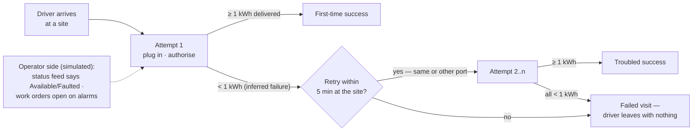
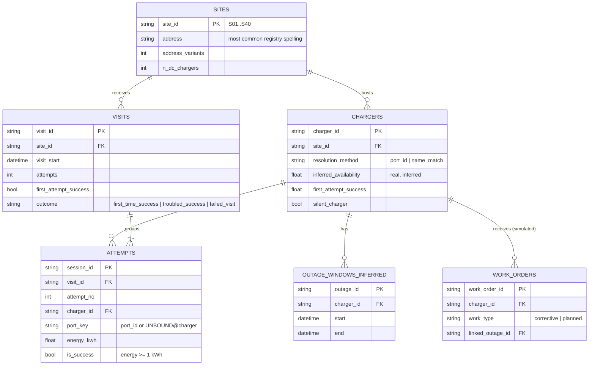
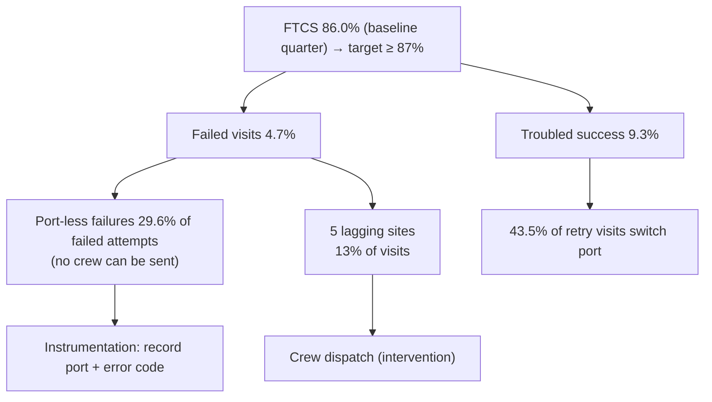

# Workflow & Data Model (Class 7)

## 1. The driver workflow we are modelling

**Entities:** site, charger, port, driver visit, attempt. **Events/states:** attempt start/end, energy delivered,
connector status (S1), outage window (inferred), work order open/close (S2). **Interactions:** driver retries and port
switches. **Interventions:** corrective and preventive work orders. **Outcome:** visit result.

## 2. Tables (all published per run under `data/processed/run_date=<d>/`)

| Table | Grain (one row = …) | Primary key | Rows (run 2025-02-01) | Basis |
|---|---|---|---|---|
| `sites.csv` | one physical site | `site_id` | 40 | real (R2 clustered) |
| `chargers.csv` | one DC charger | `charger_id` | 88 | real + inferred |
| `attempts.csv` | one charging session on a DC charger | `session_id` | 35,996 | real (R1) |
| `visits.csv` | one driver visit | `visit_id` | 29,036 | real, derived |
| `outage_windows_inferred.csv` | one inferred outage | `outage_id` | 46 | inferred from real |
| S2 `work_orders` | one work order | `work_order_id` | 426 | **simulated** |
| S1 status events | one connector status change | `event_id` | 124,968 | **simulated** |

**Why this model and not a mirror of the sources:** the KPI lives at *visit* grain, which no source stores. Visits
are built by aggregating attempts (one-to-many) *before* any join to site-level outcomes, so joins never inflate rows
(`model.attempt_row_conservation` and `model.visit_integrity` enforce this every run).

## 3. Metrics (3–5, each linked to the KPI)

| Metric | Formula | Grain | Why it matters | Link to KPI | Type |
|---|---|---|---|---|---|
| **FTCS (project KPI)** | visits with first attempt ≥ 1 kWh ÷ visits | visit | The driver's experience | — | Outcome |
| Failed-visit rate | visits with no attempt ≥ 1 kWh ÷ visits | visit | Drivers who left with nothing | Worst slice of 1 − FTCS | Outcome |
| Troubled-success rate | visits failing first, succeeding later ÷ visits | visit | Retries are friction the uptime number hides | The recoverable slice of 1 − FTCS | Interaction |
| Port-less share of failures | failed attempts with blank port ÷ failed attempts | attempt | Failures no crew can be sent to | Limits how much of 1 − FTCS repairs can reach | Instrumentation |
| Reliability-definition gap (illustrative) | operator uptime vs federal-style uptime vs inferred availability vs FTCS; repair effect | port / charger | Why "uptime" cannot be the headline; whether repairs move FTCS | Interventions act on uptime; drivers feel FTCS | Intervention |

**KPI tree**

## 4. Findings and what they do NOT prove

| Finding | What it tells the business | What it does NOT prove |
|---|---|---|
| FTCS rose from 77.7% (Jan 2024) to 86.4% (Jan 2025) | Driver experience improved over the year | That operations caused it — 42 of 88 chargers were commissioned mid-window (mix effect) |
| 5 sites sit > 5 pts below the median (S40, S17, S01, S08, S28) | Where crews should go first | Why those sites fail; S28 is only 0.05 pts past the threshold with 75 visits (fragile) |
| 29.6% of failed attempts have no port | A third of failures are invisible to any repair process | Which stage failed (authorisation, handshake, payment) |
| 15 "silent" chargers: ≥ 99% inferred available yet < 80% first-attempt success | Uptime and driver success can disagree at charger level | That these chargers are faulty — failures may be vehicle- or driver-side |
| Operator uptime 99.77% vs FTCS 86.03% (illustrative) | The dashboard metric cannot see point failures | Anything about the real operator's dashboard — S1 is simulated |
