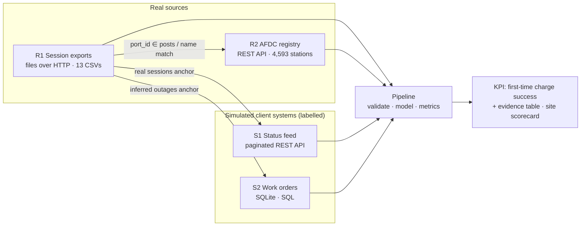

# Source Map — where the truth lives (Class 4)

Start from the decision, not the data: **"Which sites need crews now, and what must the operator start recording
before it can fix the rest?"** Every source below is here because a business question needs it.

## 1. Business questions → information → fields → source

| # | Business question | Information needed | Required fields | Source | Owner (persona) |
|---|---|---|---|---|---|
| Q1 | Did the driver get a charge on the first try? | Each charging attempt and how much energy it delivered | `session_id`, `session_start`, `session_end`, `energy_kwh` | **R1 session exports** | CPMS vendor (charging-software platform) |
| Q2 | Which charger / port was used? | Charger and port identity per attempt | `charger_id`, `port_id` (blank on 4.7% of rows) | R1 | CPMS vendor |
| Q3 | Where is that charger physically? Which attempts belong to one driver visit? | Physical site per charger | `ev_network_ids.posts`, `station_name`, `street_address`, `city`, `latitude`, `longitude` | **R2 AFDC registry** | US DOE (public registry) |
| Q4 | Is it a fast charger? | Power delivered | `peak_power_kw` | R1 | CPMS vendor |
| Q5 | Why did an attempt fail? | Error / stop reason | `session_error` (**never populated**) | R1 | CPMS vendor — **gap** |
| Q6 | Was the charger reported up or down? | Connector status over time | `status`, `error_code`, `info`, `timestamp` | **S1 status feed** (simulated) | Network operations (NOC) |
| Q7 | What did the operator do about it? | Repairs and maintenance | `opened_at`, `closed_at`, `action`, `trigger` | **S2 work orders** (simulated) | Field-service vendor |
| Q8 | What does leadership claim, and who owns the definition? | Claim + stakeholder definitions | `leadership_claim`, `stakeholders`, `kpi_owner` | `client_brief.json` (simulated) | VP Operations — **no KPI owner documented** |

## 2. Sources

| ID | Source | Real? | Retrieval mode | Grain (one row = …) | Freshness / update | Volume | Access | Trust |
|---|---|---|---|---|---|---|---|---|
| R1 | Session exports — HF `shadenn/EV_Charging_demand/raw_charging_stations/Se_MM_YYYY.csv` (CC-BY-4.0) | Real | Files over HTTP (+ committed snapshot) | one charging session (attempt) | monthly export; Jan 2024 → Jan 2025; **each file ends one day early** | 13 files, 46,575 rows, 11 MB | public | High for energy/timestamps; **no error codes**; 4.7% blank port ids |
| R2 | AFDC Alternative Fuel Stations API (`developer.nlr.gov`) | Real | REST API (+ committed snapshot) | one registry "station" — here **one charger each** | continuously updated; snapshot 2026-09-27 | 4,593 regional ChargePoint records | free API key (`DEMO_KEY` = 10 req/h) | High for identity/location; **not** evidence of 2024 availability |
| S1 | Charger status feed (OCPP-style `StatusNotification`) | **Simulated**, anchored to real sessions + inferred outages | REST API (paginated mock, 500/429 injected) | one status event per connector | event stream | 124,968 events | local mock API | Mirrors how an operator dashboard computes "uptime" |
| S2 | Maintenance work orders (CMMS) | **Simulated**, anchored to real inferred outages | SQL (SQLite) | one work order | event-driven | 426 rows | local DB | Illustrative only |

## 3. System-of-record decisions

| Critical fact | System of record | Why (ownership · freshness · replication · semantics) | Not the SoR, and why |
|---|---|---|---|
| **Did an attempt deliver energy?** (KPI input) | **R1 sessions** | The CPMS creates and meters every session; energy is measured, not reported by a person | S1 statuses are derived (a failed handshake returns to *Available* — status alone cannot tell success) |
| Attempt timing | R1 | Written by the charger/CPMS at start/stop | — |
| Port identity | R1 `port_id`; if blank → `UNBOUND@<charger>` | Only the CPMS knows the port; blank means the attempt died before port binding | Registry lists posts but not attempts |
| **Physical site** | **R2 coordinates, clustered within 150 m** | DOE registry is the only source with location; clustering removes address spelling variants | R1 `site_id`/`station_id` are always blank; the `evse_name` prefix is an **owner**, not a site, and chargers get renamed |
| Charger availability over time | **None exists in the real data** → inferred from R1 (statistical), illustrated by S1 | Registry `status_code` is a 2026 snapshot — *relevant, not authoritative* for 2024 | R2 "Available" today proves nothing about last year |
| Repair events | S2 (simulated) | The CMMS owns work orders | — |
| **KPI definition** | `config/kpi_definitions.json` (proposed) | Written, versioned, evidence-backed (D2/D3) | **Organisationally unowned** — four stakeholders disagree (`client_brief.json`); needs sign-off |

## 4. Minimum required fields (what the pipeline actually reads)

- **R1:** `charger_id`, `port_id`, `evse_name`, `session_id`, `session_start`, `session_end`, `session_error`,
  `energy_kwh`, `peak_power_kw` (+ `payment_method`, `source_file` carried for audit). Not needed: `connector_id`,
  `payment_other`, eMI3 ids (a different id type that does not join).
- **R2:** `id`, `station_name`, `street_address`, `city`, `state`, `latitude`, `longitude`, `ev_network_ids.posts`.
- **S1:** `timestamp`, `charger_id`, `port_id`, `status`, `error_code`, `info`, `data_origin`.
- **S2:** `work_order_id`, `charger_id`, `work_type`, `trigger`, `opened_at`, `closed_at`, `action`, `linked_outage_id`, `data_origin`.

## 5. Joins and coverage

| Join | Key | Coverage |
|---|---|---|
| R1 charger → R2 record | R1 `port_id` ∈ R2 `ev_network_ids.posts` | 86 / 88 DC chargers |
| fallback | normalised `evse_name` ≈ `station_name` (difflib ≥ 0.85) | 2 / 88 (the GEA-1 pair) |
| R2 records → physical sites | coordinates within 150 m | 43 address strings → **40 sites** (3 spelling variants merged; within-site ≤ 33 m, next site ≥ 17 km) |
| S1/S2 → chargers | `charger_id` | 100% (generated from the same chargers) |

## 6. Gaps (missing data is a product signal)

1. **No failure cause.** `session_error` is blank on all 46,575 rows although the federal reporting format expects an
   error on unsuccessful sessions. Failures are *inferred* from energy (< 1 kWh). → Operator must populate error codes.
2. **Port-less attempts.** 2,187 attempts (29.6% of failures) have no port — they died before the port was recorded,
   so no crew can be sent to them. → Record port at plug-in / authorisation.
3. **No driver identity.** Visits are reconstructed from site + 5-minute gaps (UC Davis "no user ID" method).
   → Capture an anonymised driver/vehicle token.
4. **No status or outage history.** The "99% uptime" cannot be checked against the real data; outages are inferred.
   → Export OCPP status logs (ChargeX KPIs need them).
5. **Incomplete exports.** Every monthly file stops at 23:59 UTC on the second-to-last day: 13 of 397 days missing.
   Checksums prove we received exactly what was published — the publication itself is incomplete. → Re-export.
6. **Registry is time-misaligned** (2026 snapshot vs 2024 sessions) — identity and location only.
7. **No KPI owner.** → A named owner must sign off the definition before the number is published as a target.

